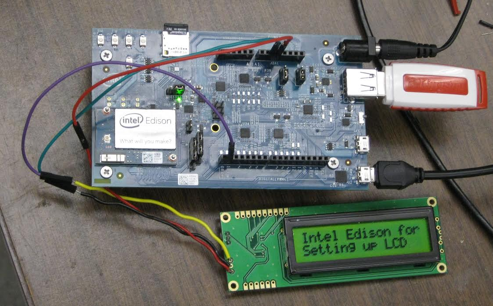

# edison-lcd

A group of utilities for testing a 2x16 serial LCD display with a Intel Edison. 
This serves the same purpose as <https://github.com/danpeirce/testLCD> but
the Edison can be attached to a interactive terminal session at the same time
it is connected to the LCD.

## Files

* setup_uart - A script that configures the UART on the Edison /dev/ttyMFD1.
* set_splash.c - Sets spalsh screen on display back to original
* send.c  - accepts string as argument and sends it to display.
* clear.c - clears display.

Since each file is a simple one file project they can be compiled on the
Edison invoking gcc as

~~~bash 
$> gcc file.c -o file
~~~

## LCD Display Module

Details at <https://www.sparkfun.com/products/9393>

